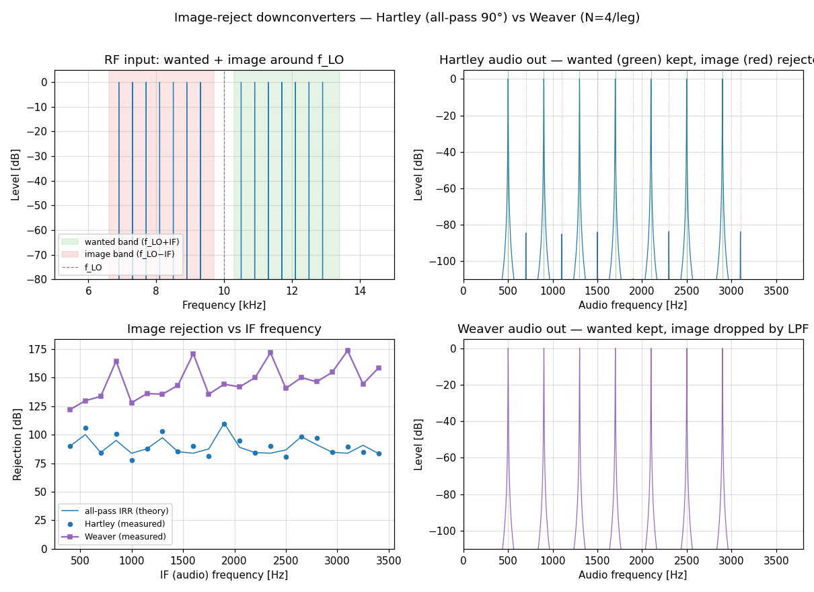
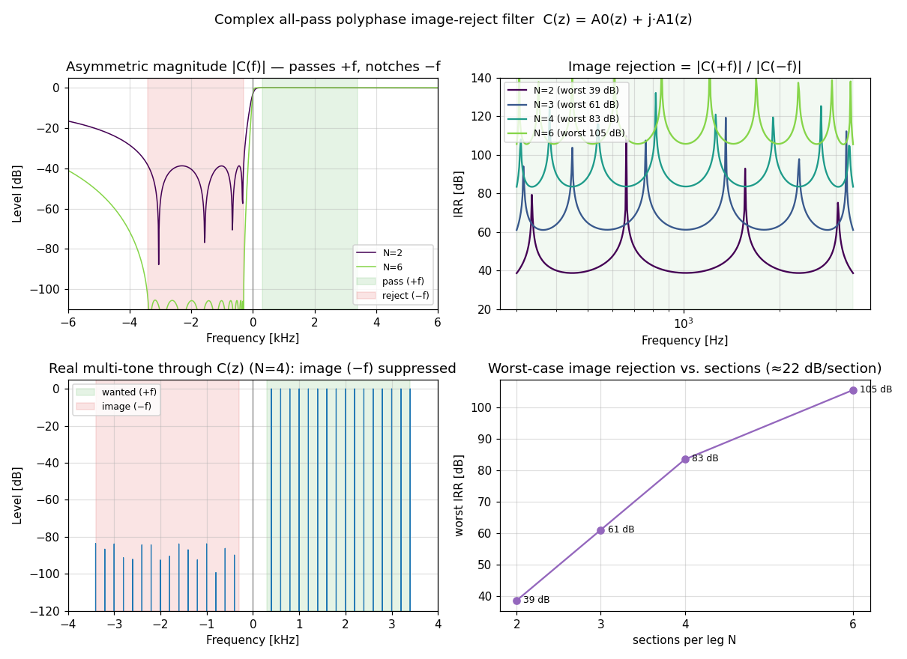
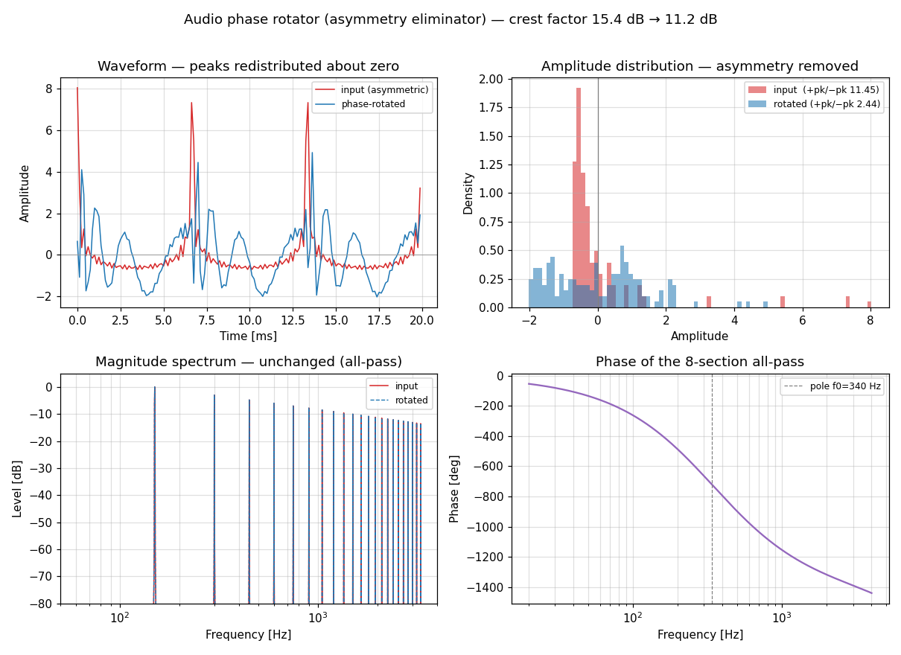
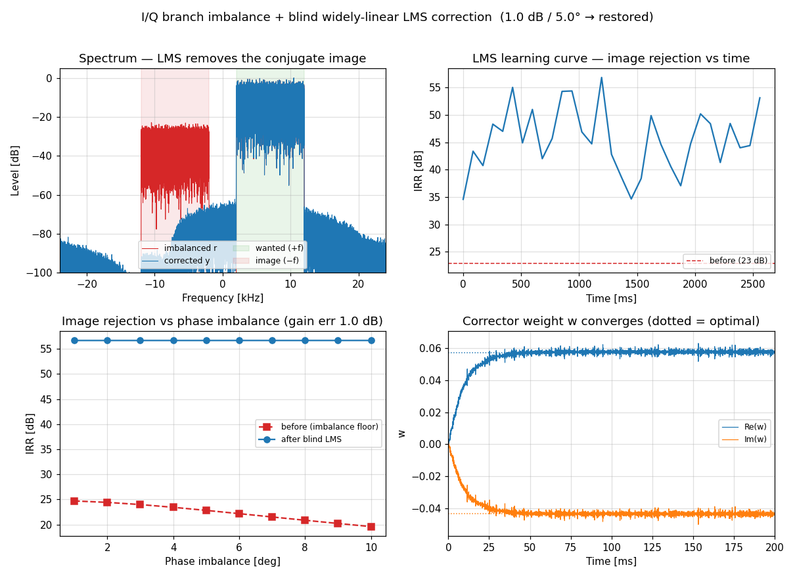
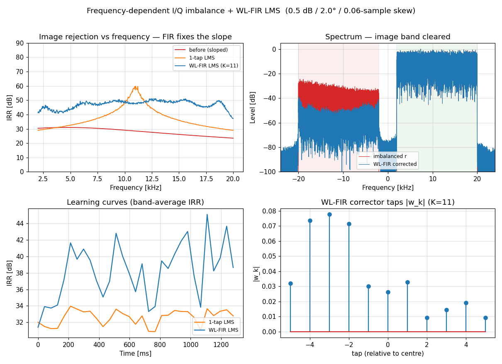
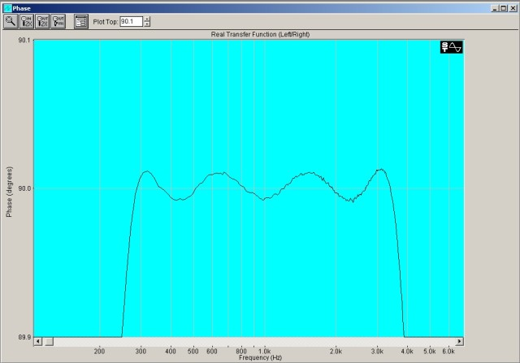
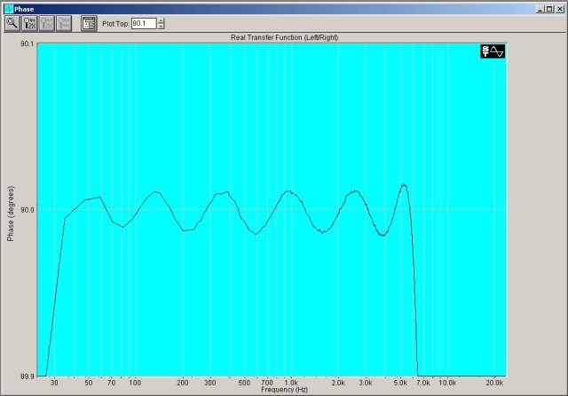
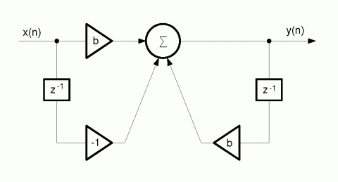

# All-Pass Phase Networks for DSP / SDR

A hands-on Python toolkit built around the classic **all-pass 90° phase-difference
network** — from *designing* the filter, through *realising* it efficiently in fixed point,
to *using* it in SSB / Hilbert / image-reject radios and *correcting* the real-hardware I/Q
imbalance that ultimately limits it.

It began as a port of the analog **`phshift.m`** methodology (Michael Spencer,
[MathWorks File Exchange #73](https://www.mathworks.com/matlabcentral/fileexchange/73-phshift))
and the `analog_to_digital_allpass.ods` bilinear conversion, and grew into a small, verified
DSP course on all-pass phasing techniques for HF transceivers.

The digital first-order all-pass section used throughout is

```
H(z) = (z⁻¹ − c) / (1 − c·z⁻¹),   pole at z = c,   c = (1 − ω₀T/2)/(1 + ω₀T/2)
```

> **Full technical write-up with every derivation, formula and result:
> [`phshift/DIGITAL_README.md`](phshift/DIGITAL_README.md).**

---

## What's inside

### Design & realisation
| Module | What it does |
|--------|--------------|
| [`phshift/digital_phshift.py`](phshift/digital_phshift.py) | Core designer — Nelder-Mead equiripple design of the two all-pass legs (digital one-step or analog+bilinear two-step), plus second-order **biquad** grouping. |
| [`phshift/elliptic_phshift.py`](phshift/elliptic_phshift.py) | **Spec-driven minimum order**: given band + target image rejection, returns the smallest N/leg (closed-form estimate `IRR≈s(L)·N−6.1 dB`, then verified). |
| [`phshift/wdf.py`](phshift/wdf.py) | **Fixed-point realisation** — WDF/one-multiplier lattice vs Direct-Form biquad under coefficient quantisation (WDF wins big: ~80 dB vs ~35 dB at Q12). |
| [`phshift/diagrams/`](phshift/diagrams) | Theme-aware **topology schematics** (SVG): section structures + the analog op-amp original. |

### Transmit
| Module | What it does |
|--------|--------------|
| [`phshift/ssb_phasing.py`](phshift/ssb_phasing.py) | **Phasing (Hartley) SSB exciter** — audio → 90° split → quadrature up-conversion; sideband suppression vs section count (~22 dB/section). |
| [`phshift/phase_rotator.py`](phshift/phase_rotator.py) | **Audio phase rotator / asymmetry eliminator** (Kahn *Symmetra-Peak*, MD-A110) — symmetrises speech peaks for more talk power. |

### Alternative topology
| Module | What it does |
|--------|--------------|
| [`phshift/polyphase_complex.py`](phshift/polyphase_complex.py) | **Complex (asymmetric) polyphase image-reject filter** `C(z)=A0+jA1` — passes +f, notches −f (digital dual of Gingell/Behbahani RC polyphase). |

### Receive
| Module | What it does |
|--------|--------------|
| [`phshift/image_reject_rx.py`](phshift/image_reject_rx.py) | **Image-reject downconverter** — Hartley (all-pass 90°) and Weaver ("third method"), side by side. |

### Hardware I/Q correction
| Module | What it does |
|--------|--------------|
| [`phshift/iq_imbalance_lms.py`](phshift/iq_imbalance_lms.py) | **Branch imbalance model + blind LMS** — `r=μs+νs*`; the corrector `y=r+w·r*` restores rejection (22.8 → 56.7 dB for 1 dB/5°). |
| [`phshift/iq_fd_imbalance_wlfir.py`](phshift/iq_fd_imbalance_wlfir.py) | **Frequency-dependent imbalance + widely-linear FIR LMS** — one weight nulls at one frequency; the FIR holds rejection across the band. |

MATLAB originals: [`phshift/phshift.m`](phshift/phshift.m), [`phfunc.m`](phshift/phfunc.m), [`phcost.m`](phshift/phcost.m).

---

## Quick start

```bash
python -m pip install numpy scipy matplotlib
```

```python
import sys; sys.path.insert(0, "phshift")
import digital_phshift as dp
import elliptic_phshift as ep

# smallest design for ≥ 60 dB image rejection over 300–3400 Hz at 48 kHz
N, d, irr = ep.min_sections(300, 3400, 48000, irr_db=60)
dp.report(d)                 # coefficients (first-order + biquad) and phase error
```

Every module also runs standalone and writes its figure, e.g. `python phshift/ssb_phasing.py`.

---

## Gallery

**Phasing SSB — unwanted-sideband suppression vs section count**


**Image-reject downconverter — Hartley (all-pass) vs Weaver**


**Fixed-point: WDF lattice vs Direct-Form biquad**


**Complex asymmetric polyphase image-reject filter**


**Audio phase rotator (asymmetry eliminator)**


**I/Q imbalance + blind LMS  ·  frequency-dependent + WL-FIR LMS**



---

## Key idea in one line

The all-pass network sets the *phase* precisely (image rejection = `−20·log₁₀|tan(ε/2)|`), but
the real-world ceiling is **branch amplitude/phase balance** (~40–60 dB) and, in fixed point,
**coefficient quantisation** — so pair a good design with the **WDF lattice** and an **adaptive
LMS** corrector.

---

## Background — the original analog design

The project started from the analog `phshift.m`, which designs a two-leg op-amp all-pass 90°
network. Its section corner ("90°") frequencies for a classic voice-band case, and the op-amp
section it targets:

<details>
<summary>Analog results (90°, N=4, 270–3600 Hz) and structure</summary>

```
Leg 1: f0 = 224.35 / 756.79 / 2232.81 / 14070.11 Hz
Leg 2: f0 =  69.08 / 435.33 / 1284.38 /  4332.57 Hz
```




</details>

The two-step design mode (`method="analog"`) reproduces these exact frequencies, then the
bilinear transform maps each op-amp section to the digital coefficient `c` above.

## References
- M. Spencer, *phshift* — analog all-pass phase-shift network designer (MathWorks FE #73).
- `digital_phase_shifter_135.pdf` — M. Beigel, *A Digital "Phase Shifter" for Musical Applications* (AES, 1979).
- Gingell (1973) & Behbahani et al. (JSSC 2001) — asymmetric / complex polyphase networks.
- Anttila, Valkama, Renfors — blind circularity-based I/Q imbalance compensation.
