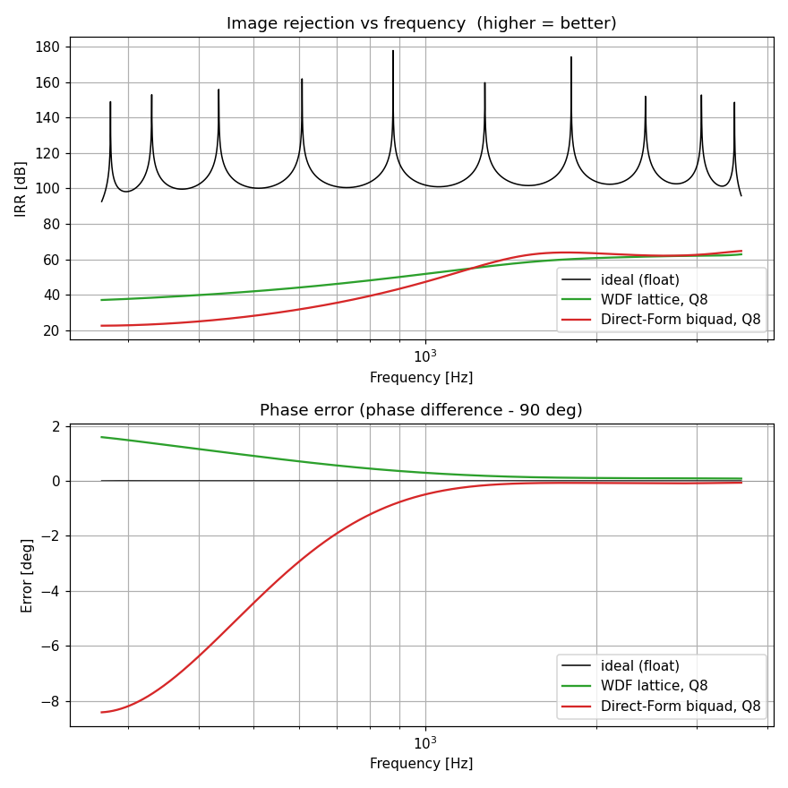
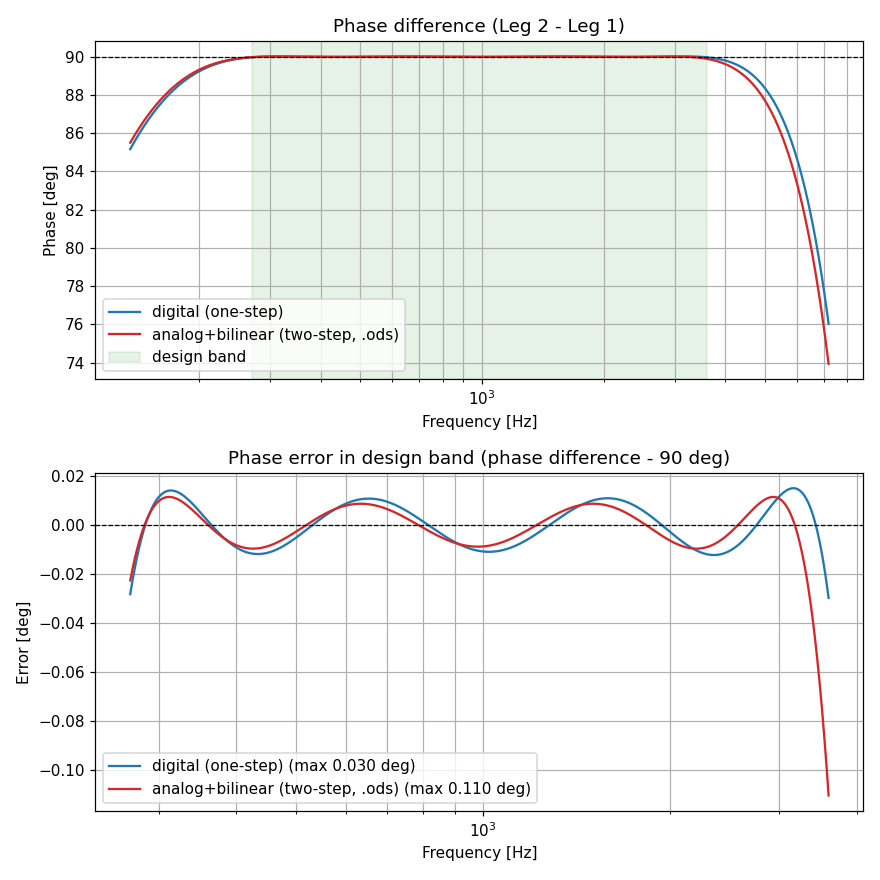
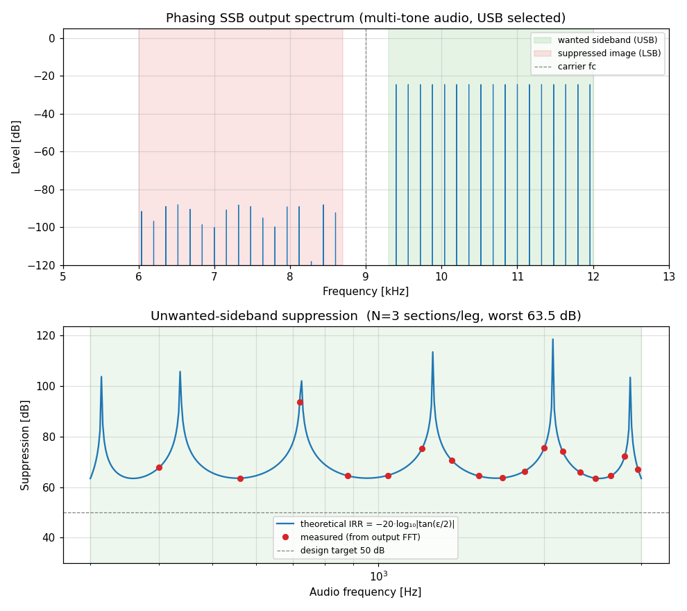

# digital_phshift.py — Digital all-pass phase-shifter designer (Python)

Python port of the analog `phshift.m` methodology, producing coefficients for a
**digital** all-pass phase-shift network (Hilbert / 90° phase splitter).

> Application: [`ssb_phasing.py`](ssb_phasing.py) uses the splitter to build a
> phasing-method (Hartley) SSB exciter and measures the unwanted-sideband
> suppression end-to-end — see [Application: SSB generation](#application-ssb-generation-ssb_phasingpy).

## Methodology

Identical optimisation to the MATLAB original:

- Two legs (outputs **I** and **Q**), each a cascade of `N` first-order all-pass sections.
- Free parameters: the 90°-frequencies `f0` of every section (in log space).
- **Nelder-Mead simplex** (`scipy.optimize.fmin`, the equivalent of MATLAB `fminsearch`)
  adjusts the `f0` so that `phase(leg2) − phase(leg1) = phdesired` across the band `[fa, fb]`.
- Cost = **p-norm** of the phase error (`p=2` → least squares, `p≈10` → equal-ripple / minimax).

Every analog 90°-frequency `f0` is mapped to a digital first-order all-pass coefficient
with the **bilinear transform** (the same formula used in `../analog_to_digital_allpass.ods`):

```
c = (1 − ω₀·T/2) / (1 + ω₀·T/2),    ω₀ = 2π·f0,    T = 1/Fs
```

giving the standard real first-order all-pass section

```
H(z) = (z⁻¹ − c) / (1 − c·z⁻¹)          pole at z = c,  |c| < 1
y[n] = −c·x[n] + x[n−1] + c·y[n−1]      difference equation
```

## Topologies

**System — two-leg phase splitter.** The input feeds two all-pass legs; their outputs
I and Q differ by ≈90° across the band. This is what the optimiser fits.


**First-order section — Direct Form II.** Canonical single-delay realisation, two
multipliers (`−c` feed-forward, `+c` feedback): `H(z) = (z⁻¹−c)/(1−c·z⁻¹)`.


**First-order section — one-multiplier lattice (WDF).** Same transfer function, but a
single multiplier equal to the pole `c`. Structurally lossless: for any quantised `c`
the numerator stays the mirror of the denominator, so `|H|≡1` and the pole only shifts by
one quantisation step — the low-sensitivity structure used in the fixed-point comparison
below.


**Second-order section — biquad.** Two first-order sections cascade into one 2nd-order
all-pass biquad (`a1 = −(c1+c2)`, `a2 = c1·c2`); see the biquad section below.


**Analog original — op-amp section.** The `phshift.m` network: a unity-gain op-amp with
two equal resistors `R` on the inverting input and an `R1–C1` low-pass on the non-inverting
input, giving `H(s) = (1 − sR1C1)/(1 + sR1C1)`, with the 90° frequency `f0 = 1/(2π·R1·C1)`.
The bilinear transform maps this section to the digital `c` above.


## Second-order (biquad) sections

Two cascaded first-order sections combine **exactly** into one 2nd-order all-pass
biquad (the "dual stage" of the AES paper / the *2-Order All-Pass Filter* table in the
`.ods`). Grouping does not change the phase response but halves the number of filter
blocks — handy for DSP hardware / libraries built around biquads:

```
H(z) = (a2 + a1·z⁻¹ + z⁻²) / (1 + a1·z⁻¹ + a2·z⁻²)
a1 = −(c1 + c2),   a2 = c1·c2                    (c1, c2 = the two first-order poles)
y[n] = a2·x[n] + a1·x[n−1] + x[n−2] − a1·y[n−1] − a2·y[n−2]
```

`report()` prints both the first-order coefficients and the biquad form (and verifies the
grouping reproduces the phase to ~1e-12°). Adjacent frequency-sorted sections are paired;
with an odd `N` the highest section is left first-order. Programmatic access:

```python
leg1, leg2 = dp.biquads(d)          # list of {"order":2,"a1":..,"a2":..} / {"order":1,"c":..}
```

## Fixed-point realisation: WDF lattice vs Direct-Form biquad (`wdf.py`)

Both structures realise the *same* ideal response, but they behave very differently under
**coefficient quantisation** (fixed point on an MCU/FPGA). `wdf.py` implements both and
compares them:

- **WDF / one-multiplier lattice** — stores the pole `c` directly as its single
  coefficient. Structurally lossless: for any quantised `c` (|c|<1) the section stays
  *exactly* all-pass and the pole just shifts one quantisation step.
  ```
  e[n] = x[n] + c·e[n−1];   y[n] = −c·e[n] + e[n−1]
  ```
- **Direct-Form II biquad** — stores `a1 = −(c1+c2)`, `a2 = c1·c2`. Near the unit circle
  (low-frequency sections) the map (a1,a2)→poles is ill-conditioned; a small error in `a2`
  can even flip the discriminant and turn two real poles into a complex pair. `a1` also
  needs an extra integer bit (|a1|<2), costing one fractional bit at equal word length.

Worst-case image rejection (IRR) across the band, 90°, N=6, 270–3600 Hz, Fs=22050:

| word length | WDF lattice | Direct-Form biquad |
|-------------|-------------|--------------------|
| float       | 92.6 dB     | 92.6 dB            |
| Q12         | **80.3 dB** | 35.3 dB            |
| Q10         | **39.8 dB** | 24.4 dB            |
| Q8          | **37.2 dB** | 22.7 dB            |
| Q6          | **27.8 dB** | 9.7 dB             |



The biquad degrades fastest at the **low-frequency band edge**, where its poles sit closest
to `z=1` — exactly the direct-form weak spot. Use the WDF lattice for fixed-point targets.

```python
import wdf
wdf.compare(d)                                   # table above
wdf.plot_compare(d, bits=8, save_prefix="cmp")   # IRR / error vs frequency
y = wdf.filter_leg(x, dp.biquads(d)[0], "wdf")   # actually filter a signal
```

## Spec-driven minimum-order design (`elliptic_phshift.py`)

The everyday question is not "how good is N sections?" but "**I need ≥ X dB of image
rejection from fa to fb — what is the smallest N?**". `elliptic_phshift.py` answers it.

- **Synthesis** reuses the equiripple (large p-norm → equal-ripple, globally optimal for a
  given N) design.
- **Order estimate** — the worst-case in-band IRR of the equiripple splitter is almost
  perfectly linear in N, with a per-section gain that depends only on the log band ratio
  `L = ln(fb/fa)` (calibrated to the designs, accurate to ~2 dB):

  ```
  IRR(N) ≈ s(L)·N − 6.1 dB,     s(L) ≈ 40.1·L^(−0.712)  dB per section
  ```

  Narrow bands (small L) buy more dB per section. `min_sections` uses this only to *start*
  the search, then **designs and verifies upward**, so the returned N is guaranteed.

```python
import elliptic_phshift as ep
N, d, irr = ep.min_sections(fa=270, fb=3600, fs=22050, irr_db=70)
# -> N=4/leg  (N=3 gives 57 dB, N=4 gives 78 dB ≥ 70)
ep.order_estimate(270, 3600, 70)     # 3.74  (fast closed-form guess)
ep.predicted_irr(4, 270, 3600)       # ~75 dB
```

> Note: a *pure* one-line elliptic (Zolotarev) formula for the corner frequencies exists in
> the classical literature (Bedrosian), but the optimal corners are more centre-clustered
> than the simple Jacobi-`sn`/`cd` node schemes and need more intricate special-function
> machinery. This module instead pairs the **closed-form order law** with the proven
> equiripple synthesis — same practical result (spec → smallest verified design), without
> unverified special-function code.

## Two design modes

The `method` argument selects **where** the bilinear conversion happens:

| Mode | `method` | What it does | 90° accuracy near Nyquist |
|------|----------|--------------|---------------------------|
| **One-step** (default) | `"digital"` | Optimiser evaluates the **digital** phase directly, so it compensates for bilinear warping. | best |
| **Two-step** | `"analog"` | Optimiser designs the **analog** network (`phfunc.m` model, no Fs), then each `f0` is bilinear-converted. Exactly the `../analog_to_digital_allpass.ods` workflow. | drifts (warping) |

The two-step mode reproduces the original MATLAB analog design frequencies (e.g. for
90°, N=4, 270–3600 Hz it gives Leg 1 = 224.35 / 756.79 / 2232.80 / 14070 Hz, matching the
repo README). It is Fs-independent in the search and simpler, but because the analog phase
is fitted (not the digital one) the digital phase difference drifts from 90° toward the
upper band edge. The one-step mode fits the digital phase itself and is more accurate.

Example (90°, N=4, 270–3600 Hz, Fs=22050), max phase error in band:

```
digital (one-step):  0.030°     analog (two-step, .ods):  0.110°
```

### Mode comparison



Both modes are near-identical through most of the band (~±0.015° equiripple). The
difference appears at the **upper band edge**: the two-step design (red) fits the *analog*
phase, so after bilinear warping its digital phase error grows to ≈0.11° near 3600 Hz,
while the one-step design (blue) fits the *digital* phase and stays within ±0.03°. The gap
widens the closer `fb` is pushed toward Nyquist.

Regenerate this figure with:

```python
import digital_phshift as dp
dd = dp.design(90, 4, 270, 3600, 22050, method="digital")
da = dp.design(90, 4, 270, 3600, 22050, method="analog")
dp.plot_compare([dd, da],
                labels=["digital (one-step)", "analog+bilinear (two-step, .ods)"],
                save_prefix="digital_phshift_compare", show=False)
```

## Requirements

`python -m pip install numpy scipy matplotlib`

## Usage

Interactive (like the MATLAB script):

```
python digital_phshift.py
```

It asks for: desired phase (90 = Hilbert), sections per leg `N`, sampling frequency `Fs`,
band `[fa, fb]` (must be < Fs/2), the p-norm, and the design mode (`digital` or `analog`).
It prints the coefficients and saves a phase plot (`digital_phshift_result.png`).

Programmatic:

```python
import digital_phshift as dp

# one-step (default)
d = dp.design(phdesired=90, N=4, fa=270, fb=3600, fs=22050, pnorm=2)
# two-step (matches analog_to_digital_allpass.ods)
d = dp.design(phdesired=90, N=4, fa=270, fb=3600, fs=22050, pnorm=2, method="analog")

dp.report(d)          # print coefficients + worst-case phase error
dp.plot(d, save_prefix="result", show=False)

d["c"]    # (N, 2) digital all-pass coefficients (poles), leg 1 and leg 2
d["f0"]   # (N, 2) analog 90° design frequencies (Hz)
d["fd"]   # (N, 2) actual digital 90° frequencies (Hz)
```

## Example (90°, N=4, 270–3600 Hz, Fs=22050)

Max phase error ≈ **0.03°** across the band. Coefficients `c` for each section
(`H(z) = (z⁻¹−c)/(1−c·z⁻¹)`):

| Leg      | c₁      | c₂      | c₃      | c₄       |
|----------|---------|---------|---------|----------|
| 1 (I)    | 0.93645 | 0.79827 | 0.49666 | −0.36323 |
| 2 (Q)    | 0.98006 | 0.87962 | 0.67794 | 0.20715  |

## Application: SSB generation (`ssb_phasing.py`)

The 90° splitter is the heart of a **phasing-method (Hartley) SSB exciter** — the
classic no-crystal-filter architecture of an HF transceiver. Audio is split into two
all-pass legs 90° apart, then quadrature-up-converted:

```
USB:  s[n] = I[n]·cos(ωc n) − Q[n]·sin(ωc n)      (wanted at fc + f_audio)
LSB:  s[n] = I[n]·cos(ωc n) + Q[n]·sin(ωc n)      (wanted at fc − f_audio)
```

Because both legs are all-pass (perfect amplitude balance), the unwanted-sideband
suppression is set **entirely by the splitter's phase error** — it equals the design IRR:

```
suppression(f) = −20·log10|tan(ε(f)/2)|
```

`ssb_phasing.py` designs the splitter from an IRR spec (300–3000 Hz comms audio,
target 50 dB → N=3 sections/leg → ~63 dB), feeds a coherent multi-tone, up-converts to a
low IF, and reads the wanted vs. image lines straight off one FFT. The measured suppression
lands exactly on the theoretical IRR curve:



Top: the USB tones sit ~65 dB above the suppressed LSB image (and the carrier is nulled by
the quadrature balance). Bottom: measured suppression (dots) vs. theoretical equiripple IRR.

```python
import ssb_phasing as ssb
# see ssb_phasing.main(); core call:
usb = ssb.ssb_modulate(audio, c, fc=9000, fs=48000, sideband="USB")
```
